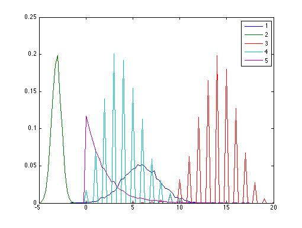

# Exercise Sheet 02
## Exercise 2.1
### a)
    p(r)=0.2
    p(b)=0.2
    p(g)=0.6
    
    p(Apple|r) = 0.3
    p(Apple|b) = 0.5
    p(Apple|g) = 0.3
    
    p(Apple) = 0.2 * 0.3 + 0.2 * 0.5 + 0.6 * 0.3 = 0.06 + 0.1 + 0.18 = 0.34
    
### b)
    
    p(Orange|r) = 0.4
    p(Orange|b) = 0.5
    p(Orange|g) = 0.3
    
    p(g|Orange) = p(Orange|g) * p(g) / p(Orange)
    
    p(Orange) = 0.2 * 0.4 + 0.2 * 0.5 + 0.6 * 0.3 = 0.08 + 0.1 + 0.18 = 0.36
    
    p(g|Orange) = 0.3 * 0.6 / 0.36 = 0.18 / 0.36 = 0.5
    
# Exercise 2.4

* Row 1 and 2 are possibly gaussian distributed since their samples are decimal numbers
* * Row 1 is N(3.9768, 3.9768)
* * Row 2 is N(-3.0028, -3.0028)
* Row 3 and 4 are possibly binominal distributed since their samples are whole numbers
* * N is both times the number of samples (10000)
* * lambda is 
* Row 5 is poisson distributed

